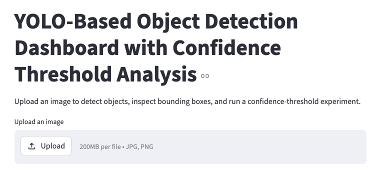
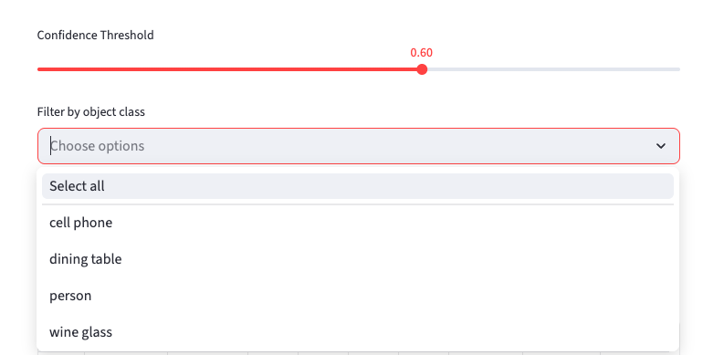
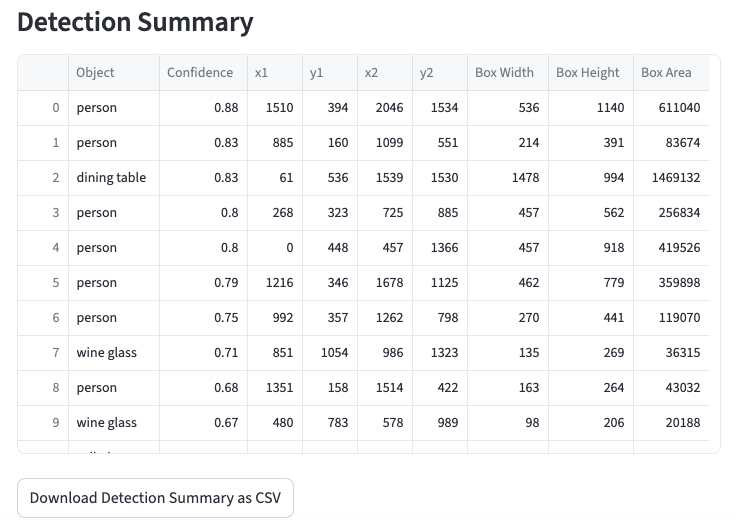
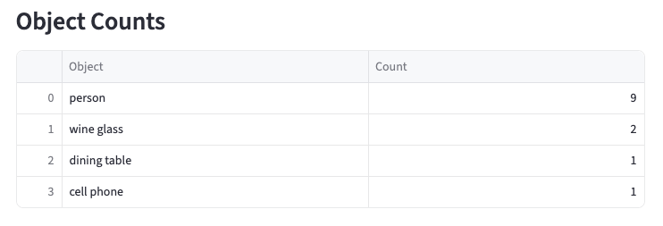
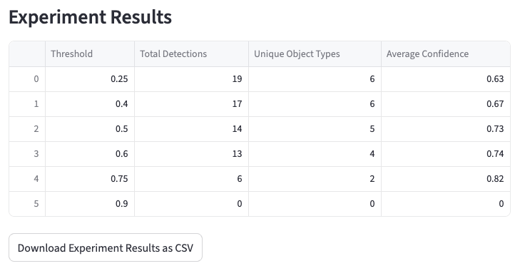
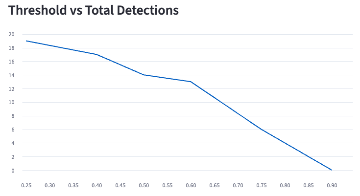
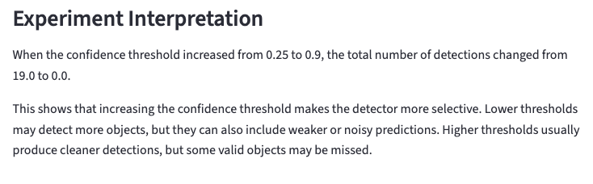

# YOLO Object Detection and Threshold Analysis Dashboard

## Overview

This project is a computer vision dashboard that uses a pretrained YOLOv8 model to detect objects in uploaded images. The app allows users to upload an image, run object detection, view bounding boxes, inspect confidence scores, filter detected object classes, and download detection results.

The project also includes a confidence-threshold experiment to study how detection behavior changes when the confidence threshold is adjusted. This makes the project more than a basic YOLO demo because it includes analysis, visualization, and downloadable experiment results.

## Screenshots

### Dashboard


### Threshold Meter and Class Filter


### Detection Summary


### Object Counts


### Experiment Results


### Threshold vs Total Detections


### Threshold vs Average Confidence


### Experiment Interpretation


## Research Question

How does changing the confidence threshold affect the number and reliability of detected objects in YOLO-based object detection?

## Project Goal

The goal of this project is to understand the practical behavior of object detection models by observing how YOLO predictions change under different confidence thresholds.

Specifically, this project explores:

- how many objects are detected at different thresholds,
- how object diversity changes as the threshold increases,
- how average confidence changes across thresholds,
- how bounding box information can be inspected and exported for analysis.

## Features

- Upload an image for object detection
- Detect objects using YOLOv8
- Display bounding boxes with object labels and confidence scores
- Adjust confidence threshold using a slider
- Filter detected objects by class
- Show total detections and unique object types
- Display detection summary table
- Display object count table
- Show bounding box coordinates
- Calculate bounding box width, height, and area
- Download detection summary as CSV
- Run confidence-threshold experiment
- Compare detection behavior across multiple thresholds
- Visualize threshold vs total detections
- Visualize threshold vs average confidence
- Generate automatic experiment interpretation
- Download threshold experiment results as CSV
- Handle phone-image rotation using EXIF correction

## Model Information

- Model: YOLOv8 Nano
- Model file: `yolov8n.pt`
- Task: Object Detection
- Input: Uploaded image
- Output:
  - Object class
  - Confidence score
  - Bounding box coordinates
- Pretraining dataset: COCO object detection dataset

## Technologies Used

- Python
- Streamlit
- Ultralytics YOLO
- OpenCV
- Pandas
- NumPy
- Pillow

## Methodology

The uploaded image is first corrected for orientation using EXIF metadata. This is important because images taken from phones may appear rotated or flipped when loaded in Python.

After preprocessing, the image is passed into a pretrained YOLOv8 object detection model. The model returns detected object classes, confidence scores, and bounding box coordinates.

The dashboard then allows the user to adjust the confidence threshold. A lower threshold allows more detections, including weaker predictions. A higher threshold makes the model more selective and usually removes lower-confidence detections.

For each detection, the dashboard records:

- object class,
- confidence score,
- bounding box coordinates,
- bounding box width,
- bounding box height,
- bounding box area.

## Confidence Threshold Experiment

The app includes a threshold experiment where the same uploaded image is evaluated using multiple confidence thresholds:

```text
0.25, 0.40, 0.50, 0.60, 0.75, 0.90
```

For each threshold, the app calculates:

- total number of detections,
- number of unique object types,
- average confidence score.

The results are displayed in a table and visualized using line charts.

## Why Confidence Threshold Matters

The confidence threshold controls how strict the detector is.

A low threshold may detect more objects, but it can also include weaker or noisy predictions.

A high threshold usually produces cleaner detections, but it may miss valid objects with lower confidence.

This project demonstrates that confidence threshold selection can significantly affect object detection results.

## Example Output

The dashboard produces:

- an annotated image with bounding boxes,
- a detection summary table,
- an object count table,
- confidence-threshold experiment results,
- charts showing threshold behavior,
- downloadable CSV files for further analysis.

## How to Run the Project

### 1. Clone or download the project

```bash
git clone <your-repository-link>
cd yolo-object-detection-dashboard
```

If you are working locally without GitHub yet, just open the project folder in VS Code.

### 2. Create a virtual environment

```bash
python3 -m venv venv
```

### 3. Activate the virtual environment

On macOS or Linux:

```bash
source venv/bin/activate
```

On Windows:

```bash
venv\Scripts\activate
```

### 4. Install dependencies

```bash
pip install -r requirements.txt
```

### 5. Run the Streamlit app

```bash
python3 -m streamlit run app.py
```

Then open the local Streamlit URL in your browser.

## Project Structure

```text
yolo-object-detection-dashboard/
│
├── app.py
├── README.md
├── requirements.txt
├── yolov8n.pt
└── venv/
```

## Current Limitations

- The current version supports image upload only.
- It does not yet support video upload.
- It does not yet support webcam-based real-time detection.
- The model is pretrained and not fine-tuned on a custom dataset.
- There is no ground-truth annotation comparison yet, so the app does not calculate formal precision, recall, or mAP.

## Future Work

Possible future improvements include:

- Add video upload support
- Add webcam-based real-time object detection
- Compare different YOLO model sizes, such as YOLOv8n, YOLOv8s, and YOLOv8m
- Add manual evaluation for correct and incorrect detections
- Calculate estimated precision from user feedback
- Evaluate model performance under different image conditions, such as blur, low light, rotation, and occlusion
- Add support for custom-trained YOLO models
- Add object tracking across video frames
- Deploy the dashboard online using Streamlit Community Cloud or Hugging Face Spaces

## Portfolio Value

This project demonstrates practical computer vision skills including:

- object detection,
- YOLO inference,
- bounding box processing,
- confidence thresholding,
- class filtering,
- detection result visualization,
- experiment design,
- result interpretation,
- CSV export for analysis.

It is suitable for a computer vision portfolio because it combines a working application with a small experimental analysis component.

## Interview Explanation

I built this project to understand object detection beyond basic image classification. Instead of only predicting what objects are present in an image, the system identifies where each object is located using bounding boxes.

I used a pretrained YOLOv8 model for object detection and built a Streamlit dashboard around it. The dashboard allows users to upload images, adjust confidence thresholds, filter object classes, inspect bounding box coordinates, and download detection results.

I also added a confidence-threshold experiment to analyze how the number of detections and average confidence change as the threshold increases. This helped me understand the trade-off between detecting more objects and keeping only high-confidence predictions.

## Author

Asibul Islam